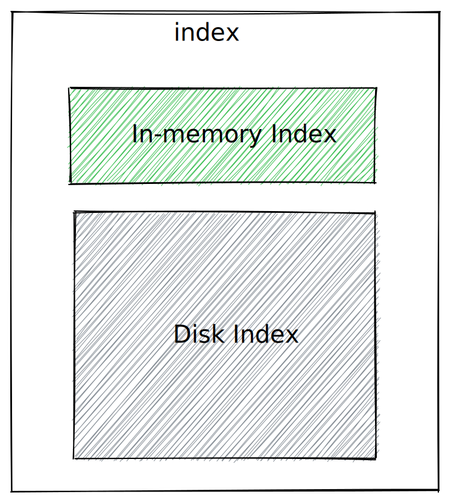
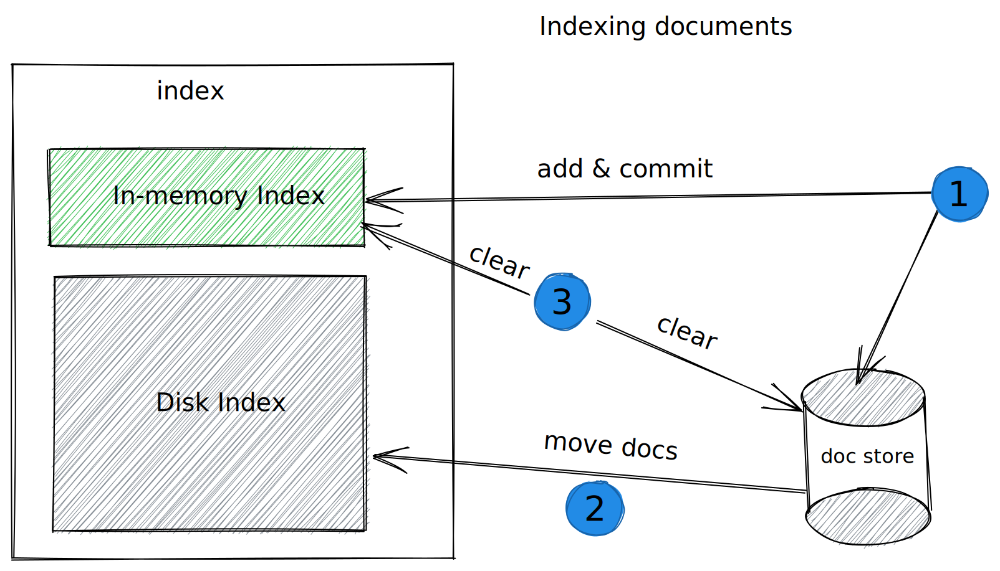
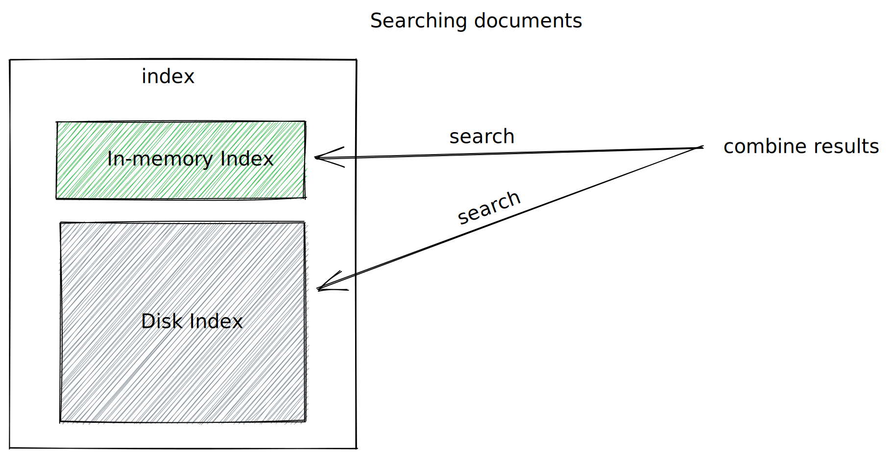

# Providing zero time to search with Tantivy

#### Diclaimer:
>While I work on Tantivy, I am still on my learning journey. This post suggests one possible solution to zero time to search. The solution might not work for you (having flows or not being scalable). Let me know and tell me how creative you're getting with Tantivy.

Let's face it, Tantivy is a wonderful piece of search engine library. It's modern, fast, and written in Rust. In short, it has all the ingredients for a modern era top-notch technology. One thing I was confused with the first time I interacted with Tantivy was the fact that indexed documents become searchable only after a commit into the index. As an end-user of the library, it's up to you and your workload to decide how often you want to commit or determine how long it is acceptable for a document to be indexed without being seen by a search. This is a valid decision for a general-purpose search engine library like Tantivy. However, if you are like me a few months back when I first tried Tantivy, You will be left irritated by that fact. You might just decide to commit on every single document you add to the index just like I did. While this works, You will soon get annoyed by the fact that Tantivy does o few bookkeeping works during commit, and committing for a single document might not be the desired behavior.

### A possible way out

The solution I am proposing is based on one of the index flavors Tantivy provides. Aside from the persistent disk-based index most users will use, Tantivy provides a hand way of creating an in-memory (RAM) index. This is very useful for testing and short-lived searchable indexes. The proposed solution is to keep hold of two indexes as depicted in the image below. One persistent on disk and one volatile in RAM. We impose a size limit of documents to the in-memory index (20.000 docs for example). This size could be more elaborate (i.e in bytes).

### How do we index document?

As depicted above, we proceed as follows: 
Step (1):  When we receive documents, we add them to the in-memory index and commit immediately assuming a commit in RAM is cheap enough for our use case. We also store the documents in a local persistent storage (doc store). This storage has two purposes. First It is used as a recovery mechanism when the application crashes. It is used to rebuild the in-memory index after a crash. Second,  when the in-memory index gets full (reaches the size limit), we use this as the data source for adding accumulated documents to the disk-based index.

Step (2): When the in-memory index has reached its size limit, we first go through all the documents in the doc store, add them to the disk-based index and apply the newly added documents with a single commit. 

Step (3): After adding the documents to the disk-based index, we clear the in-memory index and the doc store by removing all the outstanding documents in those sources. 

It's necessary to make step 2 and 3 operations fail or succeed atomically to avoid weird behavior or creepy bugs.  

### How do we search ?

 
When documents are indexed, searching them becomes pretty easy. We just forward the query to both indexes (RAM & Disk), combine, and sort the result. We can even be clever in applying top K or pagination.  

### Wrap-up

As said in the disclaimer, this is a possible solution among many. One that might not be acceptable for your use case. I am eager to hear from you and learn about how you are making use of Tantivy.  You can find a sample implementation of this solution on [github/evanxg852000/live-search](https://github.com/evanxg852000/live-search)

